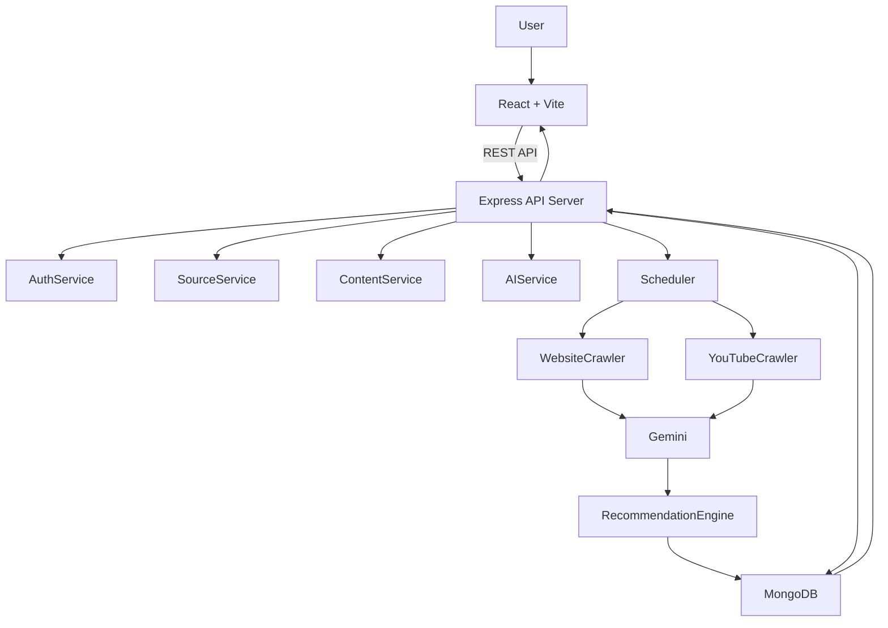
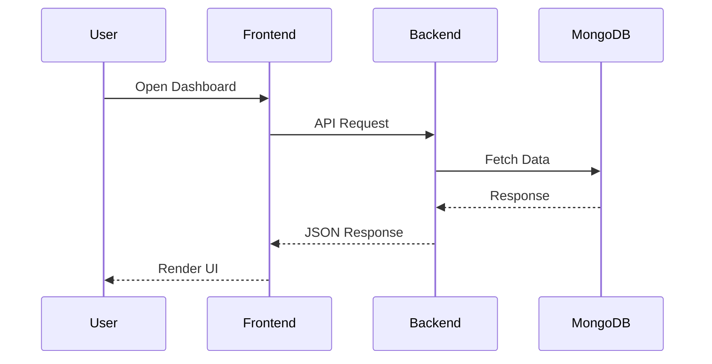

# 🏛️ System Architecture

This document describes the overall architecture, major system components, data flow, AI pipeline, scheduler workflow, and communication between services in TrendPilot AI.

---

# 1. Architecture Overview

TrendPilot AI follows a modern decoupled MERN architecture where the frontend communicates with the backend through REST APIs. The backend manages authentication, source monitoring, AI processing, scheduling, and database operations.

Google Gemini AI is responsible for generating summaries, extracting topics, identifying keywords, and creating content recommendations.

---

# 2. High-Level System Architecture



---

# 3. System Components

## Frontend

Responsible for

- Authentication
- Dashboard
- Source Management
- Recommendation UI
- Analytics
- Settings

Technology

- React
- Vite
- Tailwind CSS
- shadcn/ui

---

## Backend

Responsible for

- Authentication
- CRUD APIs
- Source Monitoring
- AI Processing
- Recommendation Engine
- Scheduler
- Database Operations

Technology

- Node.js
- Express.js

---

## Database

MongoDB Atlas stores

- Users
- Sources
- Content
- AI Summaries
- Recommendations
- Jobs

---

## Scheduler

Runs every 4–6 hours.

Responsibilities

- Check active sources
- Fetch latest blogs
- Fetch latest videos
- Detect duplicates
- Trigger AI processing

Technology

- node-cron

---

## AI Engine

Google Gemini processes

- Article text
- Video transcript
- Metadata

Returns

- Summary
- Keywords
- Topics
- Hooks
- Content Ideas
- Recommendations

---

# 4. Backend Module Architecture

```text
Backend

├── Authentication Module

├── Dashboard Module

├── Source Management

├── Website Collector

├── YouTube Collector

├── AI Engine

├── Recommendation Engine

├── Scheduler

└── Database Layer
```

---

# 5. Request Lifecycle



---

# 6. Content Processing Flow

```mermaid
flowchart TD

Source

↓

Website / YouTube

↓

Crawler

↓

Duplicate Checker

↓

Content Extractor

↓

Gemini AI

↓

Summary

↓

Keywords

↓

Topics

↓

Recommendation Engine

↓

MongoDB

↓

Dashboard
```

---

# 7. Scheduler Workflow

```mermaid
flowchart LR

Every 4 Hours

-->

Load Active Sources

-->

Check Website

-->

Check YouTube

-->

New Content?

-->

Yes

-->

Gemini AI

-->

Store Result

-->

Notify Dashboard
```

---

# 8. Authentication Flow

```text
User

↓

Login

↓

JWT Generated

↓

Protected Routes

↓

API Access

↓

Dashboard
```

---

# 9. Database Communication

```text
Users

↓

Sources

↓

Contents

↓

Recommendations

↓

Dashboard
```

---

# 10. Scalability Strategy

The architecture is designed to support future expansion.

Future improvements include

- Redis Caching
- BullMQ Queue
- Multi-worker Crawlers
- Google Trends Integration
- Competitor Analysis
- Notification Service
- Team Collaboration
- Multi-Tenant SaaS Support

---

# 11. Design Principles

The project follows

- Clean Architecture
- Modular Development
- REST API Design
- Feature-based Structure
- Separation of Concerns
- Reusable Components
- Environment-based Configuration
- Scalable MERN Architecture