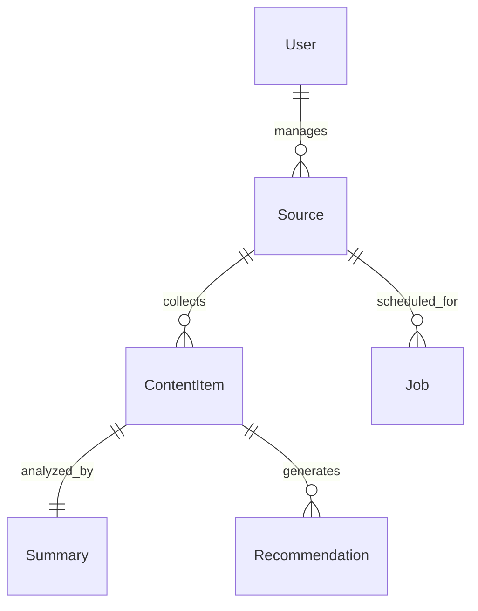

# 🗄️ Database Design

This document defines the MongoDB database architecture, collections, relationships, indexing strategy, and data flow for TrendPilot AI.

The database is designed to support scalable AI-powered content monitoring, recommendation generation, and future SaaS expansion.

---

# 1. Database Overview

TrendPilot AI uses MongoDB Atlas as the primary database.

## Main Collections

```text
users

sources

content_items

summaries

recommendations

jobs

settings
```

---

# 2. Entity Relationship Diagram



---

# 3. Collection Schemas

## users

Stores authentication and profile information.

```javascript
{
  _id: ObjectId,

  name: String,

  email: String,

  passwordHash: String,

  role: "admin" | "member",

  createdAt: Date,

  updatedAt: Date
}
```

Indexes

```
email (Unique)
```

---

## sources

Stores monitored websites and YouTube channels.

```javascript
{
  _id: ObjectId,

  userId: ObjectId,

  name: String,

  type: "website" | "youtube",

  url: String,

  category: String,

  status: "active" | "paused",

  lastCheckedAt: Date,

  createdAt: Date,

  updatedAt: Date
}
```

Indexes

```
userId

status

type
```

---

## content_items

Stores raw content collected from external sources.

```javascript
{
  _id: ObjectId,

  sourceId: ObjectId,

  externalId: String,

  title: String,

  description: String,

  url: String,

  thumbnail: String,

  author: String,

  publishedAt: Date,

  rawText: String,

  processedStatus: "pending" | "processing" | "completed" | "failed",

  createdAt: Date
}
```

Indexes

```
sourceId

externalId (Unique)

publishedAt
```

---

## summaries

Stores AI generated summaries.

```javascript
{
  _id: ObjectId,

  contentId: ObjectId,

  summary: String,

  keyPoints: [

    String

  ],

  keywords: [

    String

  ],

  topics: [

    String

  ],

  audience: String,

  confidenceScore: Number,

  aiModel: String,

  promptVersion: String,

  generatedAt: Date
}
```

---

## recommendations

Stores AI-generated content ideas.

```javascript
{
  _id: ObjectId,

  contentId: ObjectId,

  suggestedTitle: String,

  hook: String,

  outline: [

    String

  ],

  hashtags: [

    String

  ],

  platform: [

    "Facebook",

    "YouTube",

    "LinkedIn"

  ],

  contentFormat:

    "Post"

    | "Carousel"

    | "Reel"

    | "Short"

    | "Article",

  opportunityScore: Number,

  confidenceScore: Number,

  createdAt: Date
}
```

Indexes

```
contentId

opportunityScore
```

---

## jobs

Stores scheduler execution history.

```javascript
{
  _id: ObjectId,

  sourceId: ObjectId,

  startedAt: Date,

  finishedAt: Date,

  status:

    "running"

    | "completed"

    | "failed",

  error: String
}
```

---

## settings

Stores application configuration.

```javascript
{
  _id: ObjectId,

  schedulerInterval: Number,

  geminiModel: String,

  retryLimit: Number,

  notificationEnabled: Boolean,

  updatedAt: Date
}
```

---

# 4. Database Index Strategy

## users

- email

---

## sources

- userId
- status
- type

---

## content_items

- sourceId
- externalId
- publishedAt

---

## summaries

- contentId

---

## recommendations

- contentId
- opportunityScore

---

## jobs

- sourceId
- status

---

# 5. Data Lifecycle

```text
User

↓

Add Source

↓

MongoDB

↓

Scheduler

↓

Website / YouTube

↓

Content Collection

↓

Duplicate Check

↓

Store Raw Content

↓

Gemini AI

↓

Summary

↓

Recommendation

↓

Dashboard
```

---

# 6. Scalability Considerations

The database has been designed to support future enhancements including:

- Google Trends Integration
- Competitor Monitoring
- Multi-AI Model Support
- Team Collaboration
- Content Calendar
- Notification Service
- Trend Analytics
- Multi-Tenant SaaS